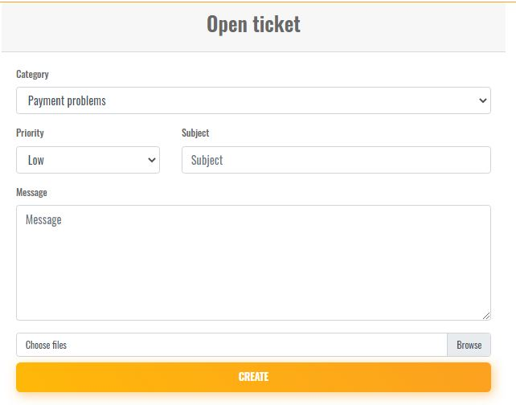
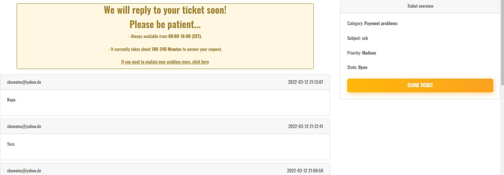
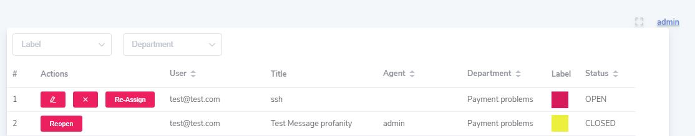

# <p align="center">Laravel Supporting Tickets</p>

## Introduction

The easiest package for adding a ticketing part to handle clients' requirements on your Laravel website.

## Documentation

### Supported Versions

Only one version of Laravel is supported for now but this package will develop in the future to support all versions.

| Version | Laravel Version |
|---- |----|
| 1.x | 7.*

## Preview

Ticket list:


Ticket creation:


Ticket show:


Admin Ticket list:


### Installation

```bash
composer require ali-sharafi/laravel-tickets
```

Once the package has been installed, you should register its routes on your local project:

```php
//web.php
use LaravelTickets\LaravelTickets;

LaravelTickets::routes(); //For main routes 
LaravelTickets::api(); // For admin routes
```

In addition, if you want to pass some options to these routes like `prefix` or `middleware`, you can pass with this format:

```php
LaravelTickets::routes([
    'middleware' => 'foo',
    'prefix' => 'bar'
]);
```

Then to add tickets table run:

```bash
php artisan migrate
```

Also you should register `Hastickets` traits in your `User` model to handle relations:

```php
//User.php

use LaravelTickets\Traits\HasTickets;

class User extends Authenticatable
{
    use HasTickets;
}
```

At the end you should run these command(if you need) to customize that:

```bash
php artisan vendor:publish --tag=tickets-config
```

This command will copy the config file to your local project and also it'll copy `tickets.php` to your `resources/lang` local directory.

```bash
php artisan vendor:publish --tag=tickets-views
```

This command will copy packages' views to your local project, it'll need to install `bootstrap` already

```bash
php artisan tickets:admin-ui vue
```

This command will add admin templates to your `js/components` directory to handle admin part, it uses `element-ui`

## Contributing

Thank you for considering contributing to Laravel Tickets! The contribution guide can be found in the [Contribution Guide](CONTRIBUTING.md).

## License

Laravel Tickets is open-sourced software licensed under the [MIT license](LICENSE.md).
